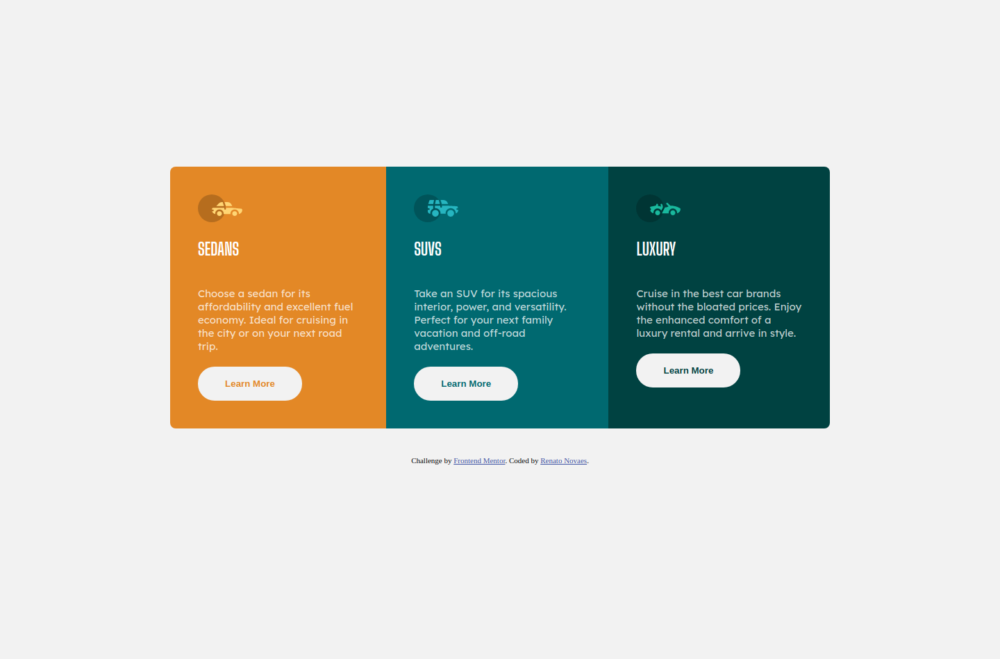

# Frontend Mentor - 3-column preview card component solution

This is a solution to the [3-column preview card component challenge on Frontend Mentor](https://www.frontendmentor.io/challenges/3column-preview-card-component-pH92eAR2-). Frontend Mentor challenges help you improve your coding skills by building realistic projects. 

## Table of contents

- [Overview](#overview)
  - [The challenge](#the-challenge)
  - [Screenshot](#screenshot)
  - [Links](#links)
- [My process](#my-process)
  - [Built with](#built-with)
  - [What I learned](#what-i-learned)
  - [Continued development](#continued-development)
- [Author](#author)
- [Acknowledgments](#acknowledgments)

**Note: Delete this note and update the table of contents based on what sections you keep.**

## Overview

### The challenge

Users should be able to:

- View the optimal layout depending on their device's screen size
- See hover states for interactive elements

### Screenshot

### Links

- Live Site URL: [Live on Netlify](https://elastic-swanson-8c86b9.netlify.app/)

## My process

### Built with

- Semantic HTML5 markup
- CSS custom properties
- Flexbox
- Mobile-first workflow

### What I learned

This was my first challenge. I have coded in a day, because I already work with Frontend Development. But this is my first step to create the habit of make challenges and help the community.

### Continued development

I work with Vue. In Vue it's easy to use CSS pre-processors. But I really would like to learn and apply here the use of SCSS in code without a framework of JavaScript.

## Author

- Website - [Renato Novaes](https://www.renatonovaes.dev)
- Instagram - [@novaes_r](https://www.instagram.com/novaes_r)
  

## Acknowledgments

[Mateus Avila](https://github.com/mateusavila) gave some valious tips about HTML and CSS. A new knowledge I will apply in all my projects from now on.
